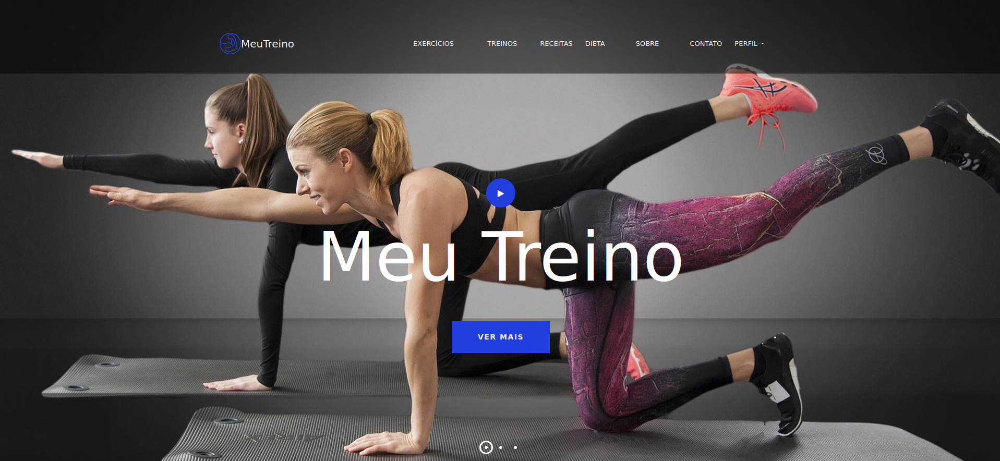

# Plataforma_Meu_Treino
 - Meu treino é uma plataforma web, onde os usuários podem criar treinos e dietas personalizados de acordo com suas necessidades e objetivos.

 

# Rodando o Projeto
### - Requisitos
- Ter o python instalado
- Ter o pacote virtualenv instalado

### 1ª passo criar ambiente virtual

    virtualenv venv

### 2ª passo instalar dependencias

    pip install -r requirements.txt

### 3ª passo Criar banco de dados e tabelas

    pyton3 manage.py makemigrations
    pyton3 manage.py migrate

### 4ª passo(opcional) Criar usuario admin

    pyton3 manage.py createsuperuser

### 5ª passo rodar a aplicação

    pyton3 manage.py runserver

### 6ª passo Se divirta acessando a aplicação
-No seu browser favorito acesse

    http://localhost:8000/

    

